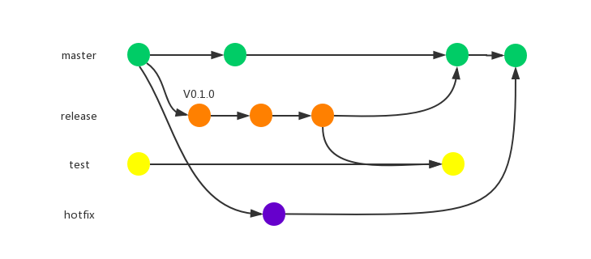

# GitFlow介绍
GitFlow是一套项目中git的操作流程与规范，用于规范项目中git操作的工作流程，提升多人协作的效率



## GitFlow中的分支

GitFlow中拥有多个代码分支，每个分支的权限以及功能各不相同。
- master

master代表生产环境，分支上保存着生产环境发布版本的代码，在此分支中不能进行commit以及push。所有的新分支都是从master新建。


- release

release分支是开发分支，日常的开发工作都在此进行，默认版本为V0.1.0。创建方法可以参照 `Mri git`中的方法。开发者拥有`commit`&`push`的权限。分支可以合并到`test`以及`release`中


- hotfix

hotfix主要用于紧急修复线上版本的错误，从master分支创建，修改完毕后合并到`master`上。


- test

test分支用来进行功能的测试，待测新功能的代码都会合并到这里，不能直接进行`commit&push`，必须从`release`分支中合并。`test`分支也不能合到`master`分支上。

- copy-test

由`mri git conflict test` 创建而来，主要用于当`release`分支合并`test`有代码冲突时的处理，建议处理完后删除

注意：copy-test ***绝对不能*** 合并到`master`分支中

## 代码开发&发布流程

### 项目创建：

拉取远端`master`代码。npm install或yarn install

```sh
git clone
yarn install/npm install
```

<br/>

---

 ### 开发新功能：
 从`master`分支中创建新的release分支，默认版本号为`V0.1.0`，并把分支推到远端。


```sh
 mri git release themeName::0.1.0
```
mri git release会自动创建分支并推送具体请参照：[mri git release](http://doc.masterrt.com/#/cli/mri-git#mri-git-release-mri-gr)

<br/>

---

### 本地分支开发：

在本地release分支中开发，完成后`commit`&`push`

<br/>

---

### release合并至test&冲突处理：

把`release`分支合并到`test`分支中去，如果有冲突，创建`copy-test`分支用来处理冲突，随后把`copy-test`推送并合并至`test`。

```sh
mri git conflict test
```
mri git conflict具体请参照： [mri git conflict](http://localhost:3000/#/cli/mri-git#mri-git-conflict)


<br/>

---

### release合并至master&冲突处理：

测试人员功能测试完毕后，合并`release`分支至`master`,如果有冲突，创建`copy-master`分支用来处理冲突，随后把`copy-master`推送并合并至`master`。
<br/>

```sh
 mri git conflict master
```

[mri git conflict](http://localhost:3000/#/cli/mri-git#mri-git-conflict)

---

## 线上版本修复过程

在master中创建hotfix分支

```ssh
mri git hotfix <theme::version> [options]
```
mri-hotfix具体请参照：
[mri-hotfix](http://doc.masterrt.com/#/cli/mri-git#mri-git-hotfix-mr-gh)